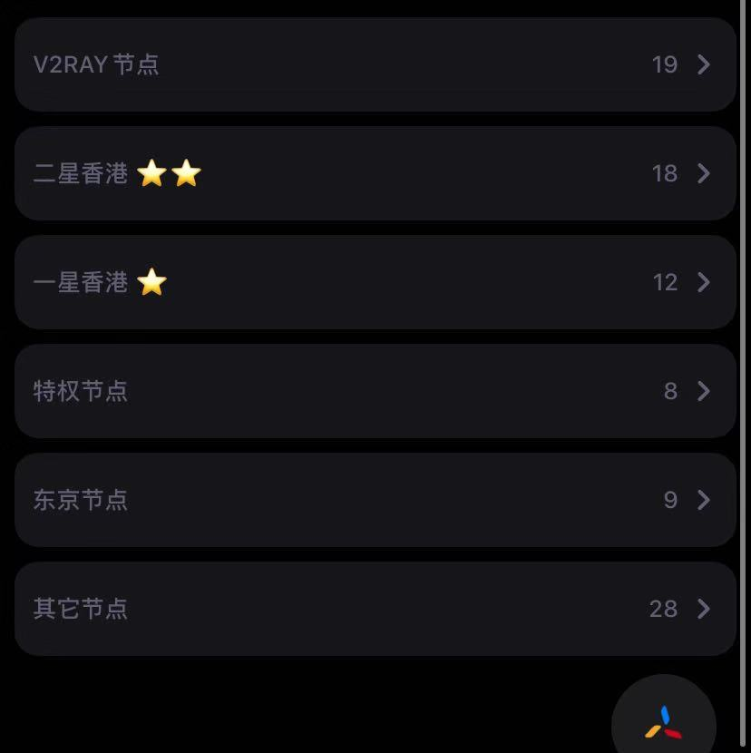

# 节点转换过滤

我们的特色是:**开源!!!开源!!!开源!!!** 自部署!!!!自部署!!!!自部署!!!!

功能开源,自己拿过去部署即可

## WHY

我有一个机场,里面有七八十个节点,每次测速都要好久

其实我只需要几个香港的节点

所以萌生了把节点过滤一下的考虑

## API Endpoint

使用方式请参考 [部署与说明文档](https://www.markeditor.com/file/get/eb581bd61fad7c345853e2ac1a5482f8?t=1574667122)

- `/api/SSRFilter` SSR订阅节点过滤
- `api/vmessfilter` V2RAY订阅节点过滤

|       地址       |       功能        |  参数   |                  说明                   |
| :--------------: | :---------------: | :-----: | :-------------------------------------: |
|  /api/SSRFilter  |  SSR订阅节点过滤  |   src   |                订阅地址                 |
|                  |                   | filter  | 要显示的节点名称正则表达式(需UrlEncode) |
|                  |                   | remove  |   要移除的节点正则表达式(需UrlEncode)   |
|                  |                   | preview |      只要有值就直接预览生成的结果       |
| /api/vmessfilter | V2RAY订阅节点过滤 |   src   |                订阅地址                 |
|                  |                   | filter  | 要显示的节点名称正则表达式(需UrlEncode) |
|                  |                   | remove  |   要移除的节点正则表达式(需UrlEncode)   |
|                  |                   | preview |      只要有值就直接预览生成的结果       |
|                  |                   |         |                                         |

例如

test.netlify.com/api/vmessfilter?preview=yes&filter=香港&src=你的订阅地址

## 自部署

